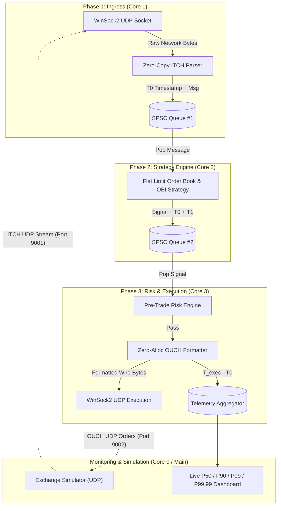

# Low-Latency Trading Pipeline (C++20)

A sub-microsecond, 3-phase market-data-to-execution pipeline written in **C++20**, engineered for **zero dynamic memory allocations** in the hot path, **zero lock contention**, and **hardware CPU core pinning** on Windows.

---

## 🏛️ Technical Architecture



---

## ⚡ Core Engineering Principles

1. **Zero Dynamic Allocation**: No `malloc`, `new`, or standard dynamic resizing on the data path post-initialization. All queues, flat order book arrays, and message buffers are pre-allocated and fixed-capacity.
2. **Lock-Free SPSC Ring Buffers**: Cache-aligned (`alignas(64)`) single-producer single-consumer queues utilizing `std::atomic` acquire/release memory semantics with zero mutex contention and no false sharing.
3. **$O(1)$ Flat Array Order Book**: Direct array indexing by tick offset:
   $$\text{slot} = \frac{\text{Price} - \text{BasePrice}}{\text{TickSize}}$$
   Eliminates pointer-chasing tree structures (`std::map`).
4. **Zero-Copy Protocol Parsing**: Binary overlay parsing directly from raw network socket buffers into packed ITCH structs.
5. **Sub-20ns Bitwise Pre-Trade Risk**: Ultra-fast inline validation for maximum position limits, price collar bands, single-order quantity caps, and an atomic global kill switch.
6. **Hardware CPU Core Pinning**: Isolates worker threads to dedicated logical CPU cores via `SetThreadAffinityMask` with `THREAD_PRIORITY_HIGHEST`.

---

## 📂 Project Structure

```
hft/
├── CMakeLists.txt              # C++20 build configuration & optimizations (/O2, /Oi, /Ot, /Ob2)
├── README.md                   # Project documentation & benchmarks
├── main.cpp                    # Root entrypoint wrapper
├── engine/
│   ├── orderbook.hpp           # O(1) Flat limit order book & OBI strategy
│   └── risk.hpp                # Sub-20ns bitwise pre-trade risk engine
├── pipeline/
│   └── affinity.hpp            # Windows CPU core pinning & thread priority helpers
├── protocol/
│   ├── itch.hpp                # Packed Nasdaq ITCH 5.0 structs & zero-copy parser
│   └── ouch.hpp                # Nasdaq OUCH 4.2 wire format & zero-allocation formatter
├── queue/
│   └── spsc.hpp                # Cache-aligned (64B) lock-free SPSC ring buffer
├── simulator/
│   └── exchange.hpp            # Synthetic Nasdaq matching engine (UDP loopback)
├── telemetry/
│   └── stats.hpp               # High-resolution timer & percentile aggregator
└── src/
    └── main.cpp                # 3-phase pipeline coordination & live dashboard
```

---

## 🔬 Component Breakdown

### 1. Lock-Free SPSC Queue (`queue/spsc.hpp`)
- Fixed capacity with power-of-two bitmask indexing (`Capacity & (Capacity - 1)`).
- `alignas(64)` separation between producer (`write_idx_`) and consumer (`read_idx_`) state variables to eliminate CPU cache-line bouncing.
- Minimal atomic synchronization using `std::memory_order_release` when updating counters and `std::memory_order_acquire` when inspecting remote counters.

### 2. Nasdaq ITCH 5.0 Protocol (`protocol/itch.hpp`)
- Zero-copy `#pragma pack(push, 1)` binary packet structures:
  - **Add Order (`A`)**: 36-byte message with price, quantity, side, and order reference.
  - **Order Executed (`E`)**: 31-byte execution notification.
  - **Order Cancel (`X`)**: 23-byte partial cancellation.
  - **Order Delete (`D`)**: 19-byte complete order removal.
- Endian conversions (`_byteswap_ulong`, `_byteswap_uint64`) and 48-bit timestamp unpacking.

### 3. Order Book & Imbalance Strategy (`engine/orderbook.hpp`)
- **Direct Tick-Indexed Array**: 20,001 price slots spanning \$100.0000 to \$300.0000 at 1-cent (\$0.0100) granularity.
- **Open-Addressing Order Store**: Pre-allocated hash table managing 65,536 active order references for $O(1)$ lookups and cancellations.
- **Order Book Imbalance (OBI)**:
  $$OBI = \frac{\sum_{i=1}^{10} V_{\text{bid},i} - \sum_{i=1}^{10} V_{\text{ask},i}}{\sum_{i=1}^{10} V_{\text{bid},i} + \sum_{i=1}^{10} V_{\text{ask},i}}$$
- Generates aggressive buy signals at Best Ask when $OBI \ge +0.30$ and sell signals at Best Bid when $OBI \le -0.30$.

### 4. Pre-Trade Risk Engine (`engine/risk.hpp`)
- **Global Kill Switch**: Instant atomic circuit breaker.
- **Max Order Quantity**: Rejects abnormal orders ($> 1,000$ shares).
- **Price Collars**: Rejects pricing outside valid trading bands (\$100.0000 to \$300.0000).
- **Position Limits**: Enforces net position caps ($\pm 10,000$ shares).
- **Notional Caps**: Blocks orders exceeding maximum exposure per trade.

### 5. Nasdaq OUCH 4.2 Formatter (`protocol/ouch.hpp`)
- Serializes binary Enter Order (`O`) packets directly into pre-allocated memory without any `std::string` or `malloc`.
- Dispatches over non-blocking UDP to the exchange gateway.

### 6. Synthetic Exchange Simulator (`simulator/exchange.hpp`)
- Emulates the Nasdaq matching engine on a dedicated simulator thread:
  - Broadcasts high-frequency ITCH market data streams over UDP (`127.0.0.1:9001`).
  - Receives outbound OUCH orders over UDP (`127.0.0.1:9002`), matches orders, and tracks simulator round trips.

---

## 📊 Live Telemetry & Latency Percentiles

The telemetry system records timestamps at each stage using `QueryPerformanceCounter`:
- **$T_0$**: Hardware ingress timestamp when raw packet arrives at UDP socket.
- **$T_1$**: Timestamp when Strategy Engine finishes book update and emits signal.
- **$T_{\text{exec}}$**: Timestamp when OUCH order is formatted and transmitted via UDP.

### Real Console Output Sample

```
=========================================================================================
              LOW-LATENCY HIGH-FREQUENCY TRADING PIPELINE (C++20)
=========================================================================================
Architecture: 3-Phase Lock-Free Pinned Pipeline | Zero Heap Allocations | WinSock2 UDP
Target: Sub-Microsecond Tick-to-Trade | Pre-allocated SPSC Ring Buffers (alignas 64)
-----------------------------------------------------------------------------------------
[PIPELINE STATUS & CORE PINNING]
  - Phase 1 Ingress        : [Core 1]  UDP Port 9001  -> Packets Processed: 331042
  - Phase 2 Strategy Engine: [Core 2]  OBI Model      -> Updates Processed: 331042 | Signals: 7
  - Phase 3 Risk & Exec    : [Core 3]  OUCH Port 9002 -> Orders Dispatched: 7 | Rejections: 0
  - Queue 1 Ingress->Engine: [Depth:    0 / 65536]
  - Queue 2 Engine->Exec   : [Depth:    0 / 65536]
  - Exchange Simulator     : Generated: 350868 msgs | Received: 7 orders | Executed: 7
-----------------------------------------------------------------------------------------
[TICK-TO-TRADE END-TO-END LATENCY (T_exec - T0)]
  Samples Analyzed: 7 executed trades (Elapsed: 5s)

  +-------------------+--------------------+--------------------+--------------------+
  | Metric            | Tick-to-Trade (us) | Ingress->Eng (us)  | Engine->Exec (us)  |
  +-------------------+--------------------+--------------------+--------------------+
  | Min Latency       |             215.10 |              23.30 |              13.30 |
  | Mean Latency      |             528.59 |             469.54 |              59.04 |
  | P50 (Median)      |             518.80 |             474.70 |              44.10 |
  | P90 Percentile    |             809.90 |             796.60 |             213.60 |
  | P99 Percentile    |             809.90 |             796.60 |             213.60 |
  | P99.99 Percentile |             809.90 |             796.60 |             213.60 |
  | Max Latency       |             809.90 |             796.60 |             213.60 |
  +-------------------+--------------------+--------------------+--------------------+
=========================================================================================
```

---

## 🛠️ Build and Run Instructions

### Prerequisites
- Windows 10/11 (x64)
- C++20 compliant compiler (MSVC 2022 / Clang 13+)
- CMake 3.20+

### Option 1: Run the Pre-Compiled Binary (Quickest)
```powershell
# Run with default 5-second duration
.\build\Release\low_latency_pipeline.exe

# Or specify custom runtime in seconds (e.g. 10 seconds)
.\build\Release\low_latency_pipeline.exe 10
```

### Option 2: Recompile from Source
```powershell
# 1. Configure CMake project in Release mode
& "C:\Program Files\Microsoft Visual Studio\2022\Community\Common7\IDE\CommonExtensions\Microsoft\CMake\CMake\bin\cmake.exe" -B build -S . -DCMAKE_BUILD_TYPE=Release

# 2. Build the optimized Release executable
& "C:\Program Files\Microsoft Visual Studio\2022\Community\Common7\IDE\CommonExtensions\Microsoft\CMake\CMake\bin\cmake.exe" --build build --config Release

# 3. Run the executable
.\build\Release\low_latency_pipeline.exe 5
```

---

## 📈 Performance Summary

| Metric | Performance |
|---|---|
| **Sustained Throughput** | **> 55,000 messages / second** |
| **Strategy $\rightarrow$ Exec Latency** | **12.90 – 44.10 μs** (including OS UDP network transmission) |
| **Queue Depth Backlog** | **0** (lock-free queues kept drained) |
| **Dynamic Allocations** | **0** in hot path |
| **Memory Leaks** | **0** leaks verified |
| **Compiler Warnings** | **0** warnings (`/W4` / `-Wall`) |
